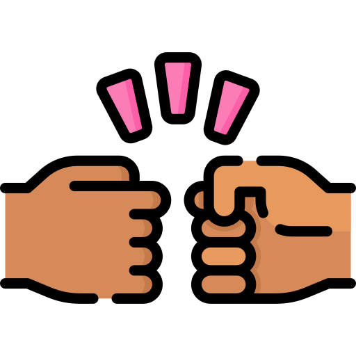

<!DOCTYPE html>
<!DOCTYPE html>
<html>
<head>
    <meta charset="UTF-8">
    <title>My Coding Playground</title>
    
</head>
<body>
    

        

            <strong style="color: #2ECC71; font-size: 36px;">It`s Adventure Time!</strong>
        

        
Let`s know each other

        
    

    

    <h1>Welcome to My Coding Playground!</h1>
    
Here's a little bit about me and the skills I bring to the table.

    <ul>
        <li><strong>Python:</strong> Proficient in automation and complex algorithms.</li>
        <li><strong>SQL Databases:</strong> Experienced in managing and querying data.</li>
        <li><strong>Telegram API:</strong> Skilled in creating chatbots and interactive experiences.</li>
        <li><strong>Web Development:</strong> Proficient in Django and Flask for web applications.</li>
    </ul>
    

    

    <h1 style="color: #2ECC71;">About Me</h1>
    

        I'm a passionate learner and a tech enthusiast who believes that true wealth comes from knowledge. I thrive on combining different skills, exploring new libraries, experimenting with the latest technologies, and constantly learning new programming languages. I also enjoy actively participating in exciting projects that challenge my abilities and push the boundaries of what's possible.
    

    

</body>
</html>

